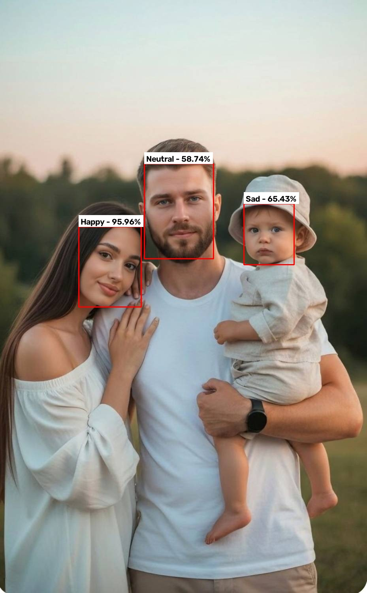

# Face Emotion Analyzer

A Python-based facial emotion recognition application that detects faces in images and analyzes their emotions using DeepFace and TensorFlow.

The application can detect multiple faces, identify the dominant emotion of each face, display the results directly on the image, and save the analysis results in JSON format.

## ✨ Features

- 👤 Face detection
- 👥 Multiple face detection
- 😊 Facial emotion recognition
- 📊 Emotion confidence scores
- 🔴 Red bounding box around detected faces
- 🏷️ Emotion label and confidence displayed above each face
- 🖼️ Visualized results directly on the image
- 💾 Save analysis results as JSON
- 📁 Automatically save processed images
- 🧩 Modular project structure
- 🧪 Component-level testing for core modules

## 🖼️ Sample Output

The following image shows an example of the application's output. Detected faces are highlighted with red bounding boxes, and the predicted emotion and confidence score are displayed above each face.

## 🛠️ Technologies

- Python 3.13
- OpenCV
- DeepFace
- TensorFlow
- RetinaFace
- NumPy
- Pillow
- Tkinter

## 📂 Project Structure

FACE-EMOTION-ANALYZER/
│
├── assets/
│   └── sample_output.jpg
│
├── tests/
│   ├── test_selector.py
│   ├── test_face_detector.py
│   ├── test_emotion_analyzer.py
│   ├── test_image_processor.py
│   ├── test_result_manager.py
│   └── test_result_visualizer.py
│
├── main.py
├── face_detector.py
├── emotion_analyzer.py
├── image_processor.py
├── file_selector.py
├── result_manager.py
├── result_visualizer.py
├── config.py
├── requirements.txt
├── .gitignore
└── README.md
> `output/ and results.json are generated locally when the application runs and are excluded from version control.

## 🔍 How It Works

The application follows a modular processing pipeline:

``text
Select Image
     ↓
Detect Faces
     ↓
Analyze Facial Emotions
     ↓
Create Structured Results
     ↓
Draw Results on Image
     ↓
Save JSON Results
     ↓
Display Final Image

For each detected face, the application identifies the dominant emotion and calculates confidence scores for the supported emotions.

## 😊 Supported Emotions

The emotion recognition model provides scores for:

- Angry
- Disgust
- Fear
- Happy
- Sad
- Surprise
- Neutral

## ⚙️ Installation

### 1. Clone the repository

bash
git clone https://github.com/BaharaHassannezhadAmjadi/face_emotion_analyzer.git
cd face_emotion_analyzer

### 2. Create a virtual environment

bash
python -m venv .venv

### 3. Activate the virtual environment

On Windows:

powershell
.venv\Scripts\activate

### 4. Install dependencies

bash
pip install -r requirements.txt

> Note: TensorFlow may require the Microsoft Visual C++ Redistributable on Windows.

## ▶️ Usage

After activating the virtual environment, run:

bash
python main.py

A file selection window will open.

Select an image containing one or more faces.

The application will then:

1. Detect the faces.
2. Analyze their emotions.
3. Draw a red bounding box around each detected face.
4. Display the predicted emotion and confidence score.
5. Save the structured results to `results.json`.
6. Save the processed image to `output/analyzed_image.jpg`.

Each time the application is run, the previous contents of `results.json` are replaced with the latest analysis results.

## 📄 Example Result

The application stores structured analysis results in `results.json`.

Example:

json
{
    "timestamp": "2026-08-30T10:15:54.647483",
    "face_count": 3,
    "faces": [
        {
            "face_id": 1,
            "dominant_emotion": "neutral",
            "emotion_scores": {
                "angry": 11.98,
                "disgust": 0.02,
                "fear": 3.53,
                "happy": 0.49,
                "sad": 25.16,
                "surprise": 0.07,
                "neutral": 58.74
            },
            "face_confidence": 1.0
        },
        {
            "face_id": 2,
            "dominant_emotion": "happy",
            "emotion_scores": {
                "angry": 0.0,
                "disgust": 0.0,
                "fear": 0.0,
                "happy": 95.96,
                "sad": 0.0,
                "surprise": 0.0,
                "neutral": 4.04
            },
            "face_confidence": 1.0
        },
        {
            "face_id": 3,
            "dominant_emotion": "sad",
            "emotion_scores": {
                "angry": 25.30,
                "disgust": 0.0,
                "fear": 0.08,
                "happy": 0.0,
                "sad": 65.43,
                "surprise": 0.0,
                "neutral": 9.19
            },
            "face_confidence": 1.0
        }
    ]
}

## 🧪 Testing

The project includes separate test files for the main components of the application.

The tests are organized inside the `tests/` directory.

Run an individual test with:

bash
python tests/test_selector.py
python tests/test_face_detector.py
python tests/test_emotion_analyzer.py
python tests/test_image_processor.py
python tests/test_result_manager.py
python tests/test_result_visualizer.py
`

These tests help verify individual components before running the complete application.

## 🧩 Project Architecture

The project is organized into separate modules, with each module responsible for a specific task.

| File | Description |
|------|-------------|
| `main.py` | Runs the complete application |
| `file_selector.py` | Opens the image selection window |
| `face_detector.py` | Detects faces in the input image |
| `emotion_analyzer.py` | Analyzes facial emotions |
| `image_processor.py` | Handles image processing operations |
| `result_manager.py` | Creates and saves structured results |
| `result_visualizer.py` | Draws bounding boxes and emotion labels |
| `config.py` | Stores project configuration |
| `requirements.txt` | Lists project dependencies |

## 📤 Output

The application generates two main types of output.

### Processed Image

`output/analyzed_image.jpg`

The processed image contains:

- Red bounding boxes around detected faces
- Emotion labels
- Confidence percentages

### JSON Results

`results.json`

The JSON file contains structured information about the detected faces and their emotion predictions.

Both `output/` and `results.json` are generated locally and should not be committed to the repository.

## 🚀 Future Improvements

Possible future improvements include:

- Real-time emotion recognition using a webcam
- Support for video files
- Improved visualization of emotion scores
- Graphical user interface
- Performance optimization
- Additional face detection models
- Export results in CSV format

## 📌 Disclaimer

Facial emotion recognition is an AI-based prediction and should not be interpreted as a definitive measurement of a person's actual emotional state.

## 👩‍💻 Author

Bahara HassannezhadAmjadi

GitHub: [BaharaHassannezhadAmjadi](https://github.com/BaharaHassannezhadAmjadi)